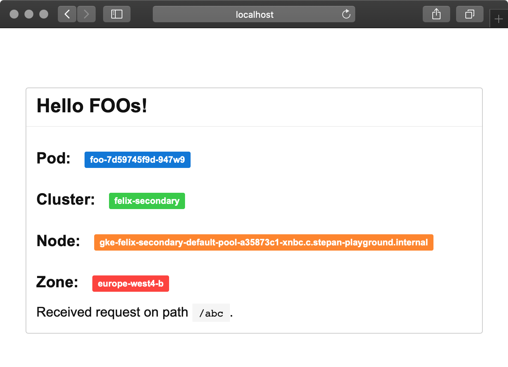

# Allen's Additions
I set up the deployments for this via Github Actions. Take a look and see the deploys. You can edit the `K8S_DEMO_APP_MESSAGE` env var inside of the kustomize overlay. The image are is built via GitHub Actions and hosted up in the Github Image Repository [here](https://github.com/users/allensallinger/packages/container/package/k8s-demo-app).

If you want to see the secret setup or modify any of it let me know and I can add you as a collaborator.

If you have access to the cluster and you would like to see the web page you can take a look at it using the following command.
`k port-forward deployment/foo 8080:8080`

# What Else I would add
1. ArgoCD for the sweet rollbacks and visuals
2. Karpenter for adding the new nodes instead of the node group.
3. HPAs for the autoscaling
4. External DNS
5. External Secrets is we needed it

# K8s Demo App

Simple web application that displays a simple message and information about Pod, GKE Cluster, GKE Node and Zone serving the request.

The application is also published as a container image [quay.io/stepanstipl/k8s-demo-app][1]

[1]: https://quay.io/repository/stepanstipl/k8s-demo-app

## Deployment

See `deploy.yaml` for simple deployment example.

The application exposes health-check `/healthz` endpoint.

## Configuration

Serving port (defaults to `8080`) can be parametrised using the `-listen-addr` flag or `K8S_DEMO_APP_LISTEN_ADDR` environment variable.

Displayed message can be parametrised by setting the `K8S_DEMO_APP_MESSAGE` variable.
